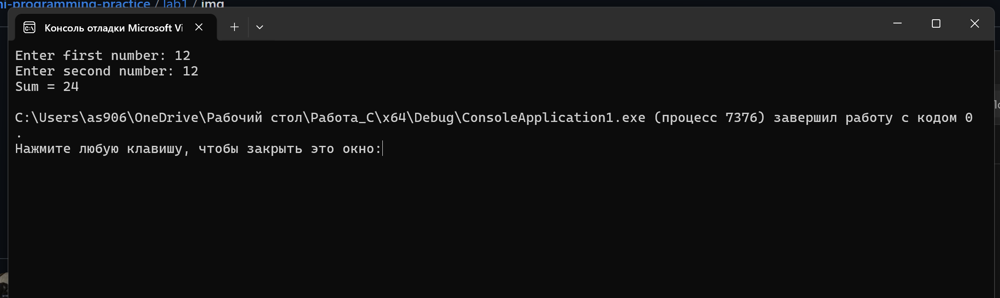
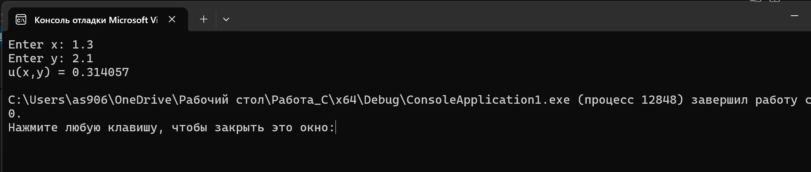
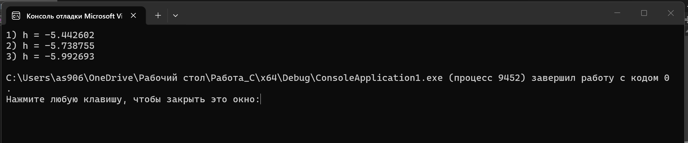
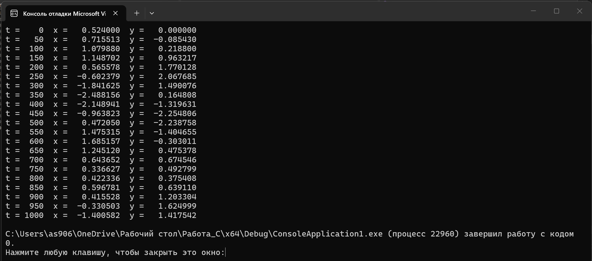
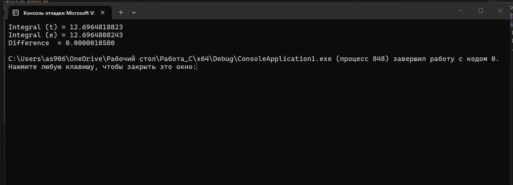
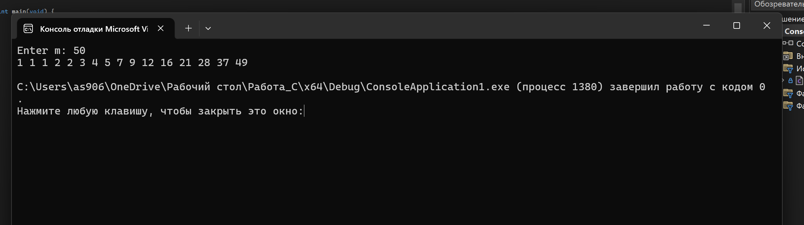
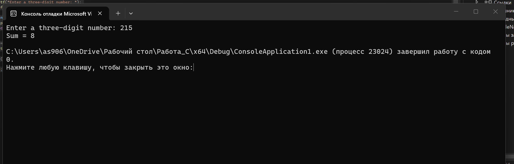

# Лабораторная работа № 1  
## Тема
Математические операции. Переменные и их типы. Операторы. Циклы. Простые условные конструкции.

## Задача 1.2
### Постановка задачи
Написать простую программу. Ввести два числа с клавиатуры, вычислить их сумму и напечатать результат.

### Математическая модель
Пусть введены два числа `a` и `b`.  
Тогда результат вычисляется по формуле:

`sum = a + b`

### Список идентификаторов

| Имя переменной | Тип данных | Смысловое обозначение |
|---|---|---|
| a | int | первое число |
| b | int | второе число |
| sum | int | сумма двух чисел |

### Код программы
```c
#include <stdio.h>

int main(void) {
    int a, b, sum;

    printf("Enter first number: ");
    scanf_s("%d", &a);

    printf("Enter second number: ");
    scanf_s("%d", &b);

    sum = a + b;

    printf("Sum = %d\n", sum);
    
    return 0;
}
```

### Результаты выполненной работы


---

## Задача 1.3
### Постановка задачи
Вычислить значение выражения `u(x, y)` при вводе `x` и `y` с клавиатуры.

### Математическая модель
Используется формула:

`u(x, y) = 1 + sin^2((x + y) / 2) + |x - (2x^2) / (1 + |sin(x + y)|)|`

Для примера можно взять нетривиальные значения:
- `x = 1.3`
- `y = 2.1`

### Список идентификаторов

| Имя переменной | Тип данных | Смысловое обозначение |
|---|---|---|
| x | double | первый аргумент |
| y | double | второй аргумент |
| u | double | значение функции |

### Код программы
```c
#include <stdio.h>
#include <math.h>

int main(void) {
    double x, y, u;

    printf("Enter x: ");
    scanf_s("%lf", &x);

    printf("Enter y: ");
    scanf_s("%lf", &y);

    u = (1 + pow(sin(x + y), 2))
        / (2 + fabs(x - (2 * x * x) / (1 + fabs(sin(x + y)))));

    printf("u(x,y) = %.6lf\n", u);

    return 0;
}
```

### Результаты выполненной работы


---

## Задача 1.4
### Постановка задачи
Вычислить значение выражения `h(x)` для трёх наборов значений параметров.

### Математическая модель
Используется формула:

`h(x) = -(x - a) / cbrt(x^2 + a^2) - 4 / pow(x^2 + b^2, 3.0 / 4.0) + a + b + cbrt((x - c)^2)`

Вычисления выполняются для наборов:
1. `a = 0.12`, `b = 3.5`, `c = 2.4`, `x = 1.4`
2. `a = 0.12`, `b = 3.5`, `c = 2.4`, `x = 1.6`
3. `a = 0.27`, `b = 3.9`, `c = 2.8`, `x = 1.8`

### Список идентификаторов

| Имя переменной | Тип данных | Смысловое обозначение |
|---|---|---|
| a | double | параметр a |
| b | double | параметр b |
| c | double | параметр c |
| x | double | аргумент |
| h | double | значение функции |

### Код программы
```c
#include <stdio.h>
#include <math.h>

int main(void) {
    double a, b, c, x, h;

    a = 0.12; b = 3.5; c = 2.4; x = 1.4;
    h = -(x - a) / cbrt(x*x + a*a)
        - (4 * pow(x*x + b*b, 3.0/4.0))
        / (2 + a + b + cbrt((x - c)*(x - c)));
    printf("1) h = %.6lf\n", h);

    a = 0.12; b = 3.5; c = 2.4; x = 1.6;
    h = -(x - a) / cbrt(x*x + a*a)
        - (4 * pow(x*x + b*b, 3.0/4.0))
        / (2 + a + b + cbrt((x - c)*(x - c)));
    printf("2) h = %.6lf\n", h);

    a = 0.27; b = 3.9; c = 2.8; x = 1.8;
    h = -(x - a) / cbrt(x*x + a*a)
        - (4 * pow(x*x + b*b, 3.0/4.0))
        / (2 + a + b + cbrt((x - c)*(x - c)));
    printf("3) h = %.6lf\n", h);

    return 0;
}
```

### Результаты выполненной работы


---

## Задача 2.1
### Постановка задачи
Вычислить с использованием цикла `for` координаты планеты Марс относительно Земли с течением времени `t`.

### Математическая модель
Используются формулы:

- `x = r1 * cos(w1 * t) - r2 * cos(w2 * t)`
- `y = r1 * sin(w1 * t) - r2 * sin(w2 * t)`
- `w1 = 2π / T1`
- `w2 = 2π / T2`

Выбраны единицы измерения:
- расстояние — астрономические единицы;
- время — сутки.

Приняты значения:
- `r1 = 1.524`
- `r2 = 1.0`
- `T1 = 687`
- `T2 = 365`

### Список идентификаторов

| Имя переменной | Тип данных | Смысловое обозначение |
|---|---|---|
| r1 | double | радиус орбиты Марса |
| r2 | double | радиус орбиты Земли |
| T1 | double | период обращения Марса |
| T2 | double | период обращения Земли |
| w1 | double | угловая скорость Марса |
| w2 | double | угловая скорость Земли |
| t | int | время |
| x | double | координата x |
| y | double | координата y |

### Код программы
```c
#include <stdio.h>
#include <math.h>

int main(void) {
    const double PI = 3.141592653589793;
    double r1 = 1.524, r2 = 1.0;
    double T1 = 687.0, T2 = 365.0;
    double w1 = 2.0 * PI / T1;
    double w2 = 2.0 * PI / T2;
    double x, y;
    int t;

    for (t = 0; t <= 1000; t += 50) {
        x = r1 * cos(w1 * t) - r2 * cos(w2 * t);
        y = r1 * sin(w1 * t) - r2 * sin(w2 * t);
        printf("t = %4d  x = %10.6lf  y = %10.6lf\n", t, x, y);
    }

    return 0;
}
```

### Результаты выполненной работы


---

## Задача 2.2
### Постановка задачи
Вычислить определённый интеграл методом трапеций.

### Математическая модель
Интеграл:

`I = ∫[a;b] e^(x+2) dx`

Выберем:
- `a = 0`
- `b = 1`

Точное значение:

`I = e^3 - e^2`

Численное значение вычисляется методом трапеций:

`I ≈ h * ((f(a) + f(b)) / 2 + f(x1) + ... + f(x(n-1)))`

где  
`h = (b - a) / n`

### Список идентификаторов

| Имя переменной | Тип данных | Смысловое обозначение |
|---|---|---|
| a | double | нижний предел интегрирования |
| b | double | верхний предел интегрирования |
| n | int | число разбиений |
| h | double | шаг |
| x | double | текущая точка |
| sum | double | сумма для метода трапеций |
| integral | double | приближённое значение интеграла |
| exact | double | точное значение интеграла |

### Код программы
```c
#include <stdio.h>
#include <math.h>

int main(void) {
    double a = 0.0, b = 1.0;
    int n = 1000;
    double h = (b - a) / n;
    double sum = 0.0, x, integral, exact;
    int i;

    for (i = 1; i < n; i++) {
        x = a + i * h;
        sum += exp(x + 2.0);
    }

    integral = h * ((exp(a + 2.0) + exp(b + 2.0)) / 2.0 + sum);
    exact = exp(3.0) - exp(2.0);

    printf("Integral (t) = %.10lf\n", integral);
    printf("Integral (e) = %.10lf\n", exact);
    printf("Difference  = %.10lf\n", fabs(integral - exact));

    return 0;
}
```

### Результаты выполненной работы


---

## Задача 2.3
### Постановка задачи
Организовать и распечатать последовательность чисел Падована, не превосходящих число `m`, введённое с клавиатуры.

### Математическая модель
Используются соотношения:
- `P(0) = P(1) = P(2) = 1`
- `P(n) = P(n - 2) + P(n - 3)`

Выводятся только те числа, которые не превосходят `m`.

### Список идентификаторов

| Имя переменной | Тип данных | Смысловое обозначение |
|---|---|---|
| m | int | верхняя граница последовательности |
| p0 | int | P(n-3) |
| p1 | int | P(n-2) |
| p2 | int | P(n-1) |
| next | int | следующее число Падована |
| i | int | счётчик цикла |

### Код программы
```c
#include <stdio.h>

int main(void) {
    int m;
    int p0 = 1, p1 = 1, p2 = 1;
    int next;
    int i;

    printf("Enter m: ");
    scanf_s("%d", &m);

    if (m >= 1) {
        printf("%d %d %d", p0, p1, p2);
    }
    else {
        printf("No numbers\n");
        return 0;
    }

    for (i = 3; ; i++) {
        next = p0 + p1;

        if (next <= m) {
            printf(" %d", next);
            p0 = p1;
            p1 = p2;
            p2 = next;
        }
        else {
            break;
        }
    }

    printf("\n");
    return 0;
}
```

### Результаты выполненной работы


---

## Задача 2.4
### Постановка задачи
С клавиатуры вводится трёхзначное число, считается сумма его цифр. Если сумма цифр числа больше 10, то вводится следующее трёхзначное число, если сумма меньше либо равна 10 — программа завершается.

### Математическая модель
Для числа `n`:
- сотни: `n / 100`
- десятки: `(n / 10) % 10`
- единицы: `n % 10`

Сумма цифр:

`sum = n / 100 + (n / 10) % 10 + n % 10`

### Список идентификаторов

| Имя переменной | Тип данных | Смысловое обозначение |
|---|---|---|
| n | int | трёхзначное число |
| sum | int | сумма цифр числа |

### Код программы
```c
#include <stdio.h>

int main(void) {
    int n, sum;

    do {
        printf("Enter a three-digit number: ");
        scanf_s("%d", &n);

        if (n < 100 || n > 999) {
            printf("Try again.\n");
            continue;
        }

        sum = n / 100 + (n / 10) % 10 + n % 10;
        printf("Sum = %d\n", sum);

    } while (sum > 10);

    return 0;
}
```

### Результаты выполненной работы


---

## Информация о студенте
Мартынова Алина, 1 курс, группа ИВТ-1
