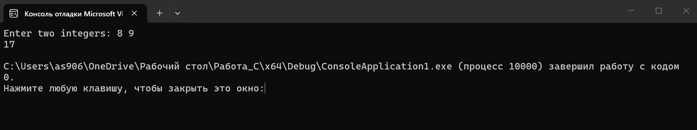
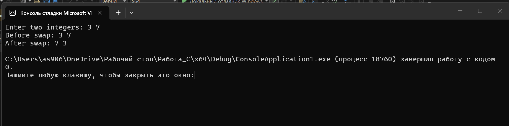
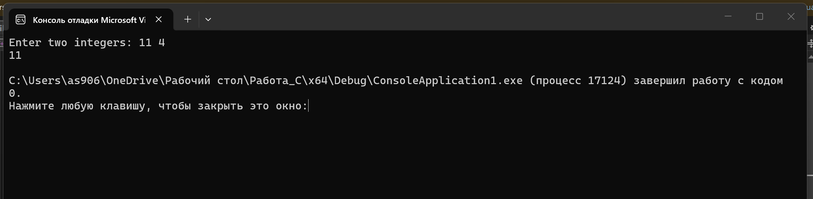
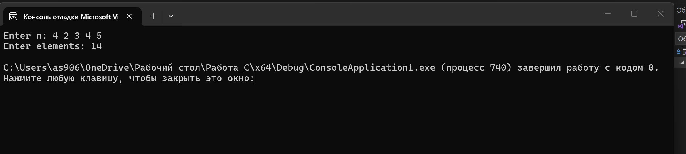
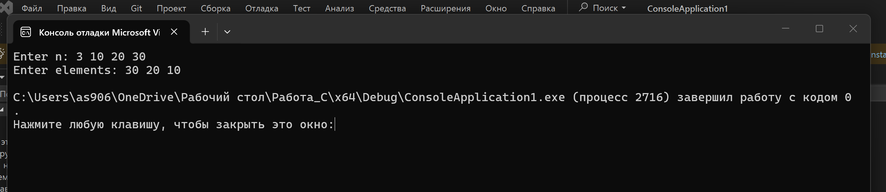
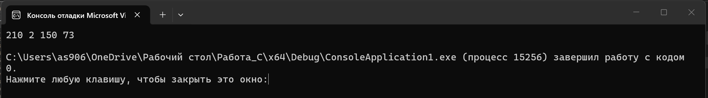
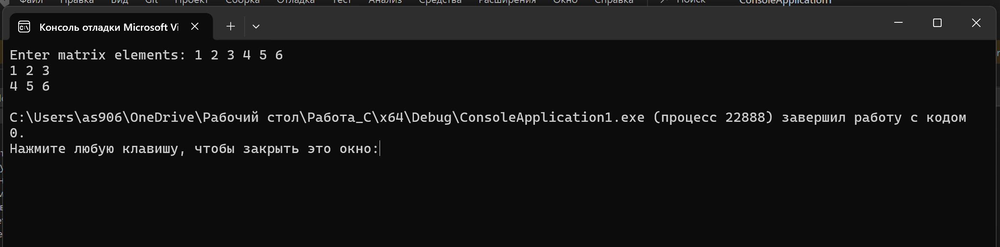

# Лабораторная работа № 2

## Тема
Указатели и динамическая память.


## Задача 1

### Постановка задачи
Задача 1: Сложение через указатели (task01.c)

Цель: получить значение переменных через указатели.  
Вход: два целых числа `a`, `b`.  
Выход: сумма чисел.  
Требование: складывать значения через указатели `int *pa`, `int *pb`.

Пример:  
Ввод: `8 9`  
Вывод: `17`

### Математическая модель
Пусть введены два целых числа `a` и `b`.  
Создаются указатели `pa` и `pb`, которые хранят адреса этих переменных.  
Тогда сумма вычисляется через обращение по указателям:

`sum = *pa + *pb`

### Список идентификаторов

| Имя переменной | Тип данных | Смысловое обозначение |
|---|---|---|
| a | int | первое число |
| b | int | второе число |
| pa | int* | указатель на первое число |
| pb | int* | указатель на второе число |
| sum | int | сумма чисел |

### Код программы

```c
#include <stdio.h>

int main(void) {
    int a, b, sum;
    int *pa, *pb;

    printf("Enter two integers: ");
    scanf_s("%d %d", &a, &b);

    pa = &a;
    pb = &b;

    sum = *pa + *pb;

    printf("%d\n", sum);

    return 0;
}
```

### Результаты выполненной работы


---

## Задача 2

### Постановка задачи
Задача 2: Обмен двух чисел (task02.c)

Цель: изменить данные по адресу (`swap`).  
Вход: два целых числа `a`, `b`.  
Выход: сначала исходные, затем обменённые значения.  
Требование: обмен выполнять через указатели.

Пример:  
Ввод: `3 7`  
Вывод: `3 7` и затем `7 3`

### Математическая модель
Пусть заданы два целых числа `a` и `b`.  
Для обмена значений используются указатели на эти переменные.  
Обмен выполняется через временную переменную:

`temp = *pa`  
`*pa = *pb`  
`*pb = temp`

### Список идентификаторов

| Имя переменной | Тип данных | Смысловое обозначение |
|---|---|---|
| a | int | первое число |
| b | int | второе число |
| pa | int* | указатель на первое число |
| pb | int* | указатель на второе число |
| temp | int | временная переменная для обмена |

### Код программы

```c
#include <stdio.h>

int main(void) {
    int a, b, temp;
    int *pa, *pb;

    printf("Enter two integers: ");
    scanf_s("%d %d", &a, &b);

    pa = &a;
    pb = &b;

    printf("Before swap: %d %d\n", a, b);

    temp = *pa;
    *pa = *pb;
    *pb = temp;

    printf("After swap: %d %d\n", a, b);

    return 0;
}
```

### Результаты выполненной работы


---

## Задача 3

### Постановка задачи
Задача 3: Максимум через указатели (task03.c)

Цель: условие с обращением по указателю.  
Вход: два целых числа.  
Выход: максимальное из них.  
Требование: сравнивать значения через указатели.

Пример:  
Ввод: `11 4`  
Вывод: `11`

### Математическая модель
Пусть введены два целых числа `a` и `b`.  
Создаются указатели `pa` и `pb`, которые указывают на эти переменные.  
Сравнение выполняется через обращение по указателям.

Если `*pa > *pb`, то максимум равен `*pa`.  
Иначе максимум равен `*pb`.

### Список идентификаторов

| Имя переменной | Тип данных | Смысловое обозначение |
|---|---|---|
| a | int | первое число |
| b | int | второе число |
| pa | int* | указатель на первое число |
| pb | int* | указатель на второе число |
| max | int | максимальное число |

### Код программы

```c
#include <stdio.h>

int main(void) {
    int a, b, max;
    int *pa, *pb;

    printf("Enter two integers: ");
    scanf_s("%d %d", &a, &b);

    pa = &a;
    pb = &b;

    if (*pa > *pb) {
        max = *pa;
    }
    else {
        max = *pb;
    }

    printf("%d\n", max);

    return 0;
}
```

### Результаты выполненной работы


---

## Задача 4

### Постановка задачи
Задача 4: Динамический массив и сумма (task04.c)

Цель: выделить память под массив и пройти его указателем.  
Вход: число `n`, затем `n` целых чисел.  
Выход: сумма всех элементов.  
Ограничения: `1 <= n <= 1000`.  
Требование: обход элементов через арифметику указателей, для динамической памяти использовать `malloc` и `free`.

Пример:  
Ввод: `4` и `2 3 4 5`  
Вывод: `14`

### Математическая модель
Пусть введено число `n`, которое задаёт количество элементов массива.  
После этого вводятся элементы массива:

`a0, a1, a2, ..., an-1`

Сумма элементов массива вычисляется по формуле:

`sum = a0 + a1 + a2 + ... + an-1`

Так как массив создаётся динамически, память под него выделяется с помощью `malloc`.  
Обращение к элементам выполняется через указатель и арифметику указателей:

`*(arr + i)`

После окончания работы память освобождается с помощью `free`.

### Список идентификаторов

| Имя переменной | Тип данных | Смысловое обозначение |
|---|---|---|
| n | int | количество элементов массива |
| arr | int* | указатель на динамический массив |
| i | int | счётчик цикла |
| sum | int | сумма элементов массива |

### Код программы

```c
#include <stdio.h>
#include <stdlib.h>

int main(void) {
    int n, i, sum = 0;
    int *arr;

    printf("Enter n: ");
    scanf_s("%d", &n);

    if (n < 1 || n > 1000) {
        printf("Invalid n\n");
        return 1;
    }

    arr = (int*)malloc(n * sizeof(int));

    if (arr == NULL) {
        printf("Memory allocation error\n");
        return 1;
    }

    printf("Enter elements: ");
    for (i = 0; i < n; i++) {
        scanf_s("%d", arr + i);
    }

    for (i = 0; i < n; i++) {
        sum += *(arr + i);
    }

    printf("%d\n", sum);

    free(arr);

    return 0;
}
```

### Результаты выполненной работы


---

## Задача 5

### Постановка задачи
Задача 5: Обратный вывод динамического массива (task05.c)

Цель: использовать декремент указателя.  
Вход: число `n`, затем `n` целых чисел.  
Выход: элементы в обратном порядке.  
Ограничения: `1 <= n <= 1000`.  
Требование: использовать указатель и операцию `--`, для динамической памяти использовать `malloc` и `free`.

Пример:  
Ввод: `3` и `10 20 30`  
Вывод: `30 20 10`

### Математическая модель
Пусть введён массив из `n` элементов:

`a0, a1, a2, ..., an-1`

Для вывода в обратном порядке нужно начать с последнего элемента массива и постепенно переходить к предыдущему.  
Если указатель сначала поставить на последний элемент:

`p = arr + n - 1`

то после вывода текущего элемента можно перейти к предыдущему с помощью операции:

`p--`

Таким образом элементы выводятся от конца массива к началу.

### Список идентификаторов

| Имя переменной | Тип данных | Смысловое обозначение |
|---|---|---|
| n | int | количество элементов массива |
| arr | int* | указатель на динамический массив |
| p | int* | указатель для обратного прохода по массиву |
| i | int | счётчик цикла |

### Код программы

```c
#include <stdio.h>
#include <stdlib.h>

int main(void) {
    int n, i;
    int *arr, *p;

    printf("Enter n: ");
    scanf_s("%d", &n);

    if (n < 1 || n > 1000) {
        printf("Invalid n\n");
        return 1;
    }

    arr = (int*)malloc(n * sizeof(int));

    if (arr == NULL) {
        printf("Memory allocation error\n");
        return 1;
    }

    printf("Enter elements: ");
    for (i = 0; i < n; i++) {
        scanf_s("%d", arr + i);
    }

    p = arr + n - 1;

    for (i = 0; i < n; i++) {
        printf("%d ", *p);
        p--;
    }

    printf("\n");

    free(arr);

    return 0;
}
```

### Результаты выполненной работы


---

## Задача 6

### Постановка задачи
Задача 6: Побайтовый вывод `int` (task06.c)

Цель: понять, как данные хранятся в памяти.  
Дано: `int a = 1234567890;`  
Выход: значения байтов переменной в десятичном виде.  
Требование: использовать указатель `unsigned char *`.

### Математическая модель
Переменная типа `int` занимает в памяти несколько байтов.  
Чтобы посмотреть содержимое этой переменной по байтам, нужно получить адрес переменной `a` и привести его к типу `unsigned char *`.

Указатель `unsigned char *` позволяет обращаться не ко всему числу сразу, а к отдельным байтам памяти.

Количество байтов определяется так:

`sizeof(a)`

Каждый байт выводится отдельно через указатель:

`*(p + i)`

### Список идентификаторов

| Имя переменной | Тип данных | Смысловое обозначение |
|---|---|---|
| a | int | исходное целое число |
| p | unsigned char* | указатель на байты переменной |
| i | int | счётчик цикла |

### Код программы

```c
#include <stdio.h>

int main(void) {
    int a = 1234567890;
    unsigned char *p;
    int i;

    p = (unsigned char*)&a;

    for (i = 0; i < sizeof(a); i++) {
        printf("%u ", *(p + i));
    }

    printf("\n");

    return 0;
}
```

### Результаты выполненной работы


---

## Задача 7

### Постановка задачи
Задача 7: Динамическая матрица 2x3 (task07.c)

Цель: выполнить базовую работу с двумерным динамическим массивом.  
Вход: 6 целых чисел для матрицы `2 x 3`.  
Выход: та же матрица построчно.  
Требование: выделить память как массив указателей на строки и корректно освободить.

Пример:  
Ввод: `1 2 3 4 5 6`  
Вывод:

`1 2 3`  
`4 5 6`

### Математическая модель
Матрица размером `2 x 3` состоит из двух строк и трёх столбцов.

Её можно представить в виде:

`a00 a01 a02`  
`a10 a11 a12`

Для работы с динамической матрицей сначала выделяется память под массив указателей на строки.  
Затем для каждой строки отдельно выделяется память под три элемента.

Обращение к элементу матрицы выполняется так:

`matrix[i][j]`

После вывода матрицы нужно освободить память.  
Сначала освобождаются строки, затем массив указателей.

### Список идентификаторов

| Имя переменной | Тип данных | Смысловое обозначение |
|---|---|---|
| matrix | int** | указатель на динамическую матрицу |
| i | int | номер строки |
| j | int | номер столбца |
| rows | int | количество строк |
| cols | int | количество столбцов |

### Код программы

```c
#include <stdio.h>
#include <stdlib.h>

int main(void) {
    int **matrix;
    int rows = 2, cols = 3;
    int i, j;

    matrix = (int**)malloc(rows * sizeof(int*));

    if (matrix == NULL) {
        printf("Memory allocation error\n");
        return 1;
    }

    for (i = 0; i < rows; i++) {
        matrix[i] = (int*)malloc(cols * sizeof(int));

        if (matrix[i] == NULL) {
            printf("Memory allocation error\n");

            for (j = 0; j < i; j++) {
                free(matrix[j]);
            }

            free(matrix);
            return 1;
        }
    }

    printf("Enter matrix elements: ");
    for (i = 0; i < rows; i++) {
        for (j = 0; j < cols; j++) {
            scanf_s("%d", &matrix[i][j]);
        }
    }

    for (i = 0; i < rows; i++) {
        for (j = 0; j < cols; j++) {
            printf("%d ", matrix[i][j]);
        }
        printf("\n");
    }

    for (i = 0; i < rows; i++) {
        free(matrix[i]);
    }

    free(matrix);

    return 0;
}
```

### Результаты выполненной работы

