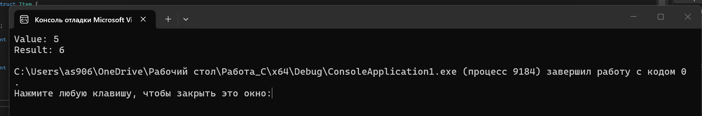
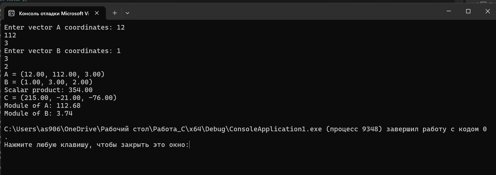

# Лабораторная работа № 3

## Тема
Структуры.

## Задача 1.1

### Постановка задачи
Задача 1.1: Структура с указателем на функцию (task01.c)

Цель: создать структуру, в которой есть обычное поле и указатель на функцию.  
Вход: число, над которым будет выполняться функция.  
Выход: результат работы функции.  
Требование: вызвать функцию через имя переменной структуры и поле указателя на функцию.

### Математическая модель
Пусть есть некоторое число `x`.  
Для него задана функция, например увеличение числа на единицу:

`f(x) = x + 1`

В структуре хранится значение `x` и указатель на функцию.  
Вызов функции выполняется через поле структуры:

`obj.func(obj.value)`

### Список идентификаторов

| Имя переменной | Тип данных | Смысловое обозначение |
|---|---|---|
| value | int | число, хранящееся в структуре |
| func | int (*)(int) | указатель на функцию |
| item | struct Item | переменная структуры |
| x | int | параметр функции |

### Код программы

```c
#include <stdio.h>

struct Item {
    int value;
    int (*func)(int);
};

int increase(int x) {
    return x + 1;
}

int main(void) {
    struct Item item;

    item.value = 5;
    item.func = increase;

    printf("Value: %d\n", item.value);
    printf("Result: %d\n", item.func(item.value));

    return 0;
}
```

### Результаты выполненной работы


---

## Задача 1.2

### Постановка задачи
Задача 1.2: Вектор в трёхмерном пространстве (task02.c)

Цель: создать структуру для вектора в 3-х мерном пространстве и выполнить основные операции над векторами.  
Вход: координаты двух векторов.  
Выход: скалярное произведение, векторное произведение, модуль вектора и распечатка вектора в консоли.  
Требование: в структуре вектора указать имя вектора отдельным полем.

### Математическая модель
Вектор в трёхмерном пространстве задаётся тремя координатами:

`A = (x1, y1, z1)`  
`B = (x2, y2, z2)`

Скалярное произведение вычисляется по формуле:

`A · B = x1 * x2 + y1 * y2 + z1 * z2`

Векторное произведение вычисляется по формуле:

`A x B = (y1 * z2 - z1 * y2, z1 * x2 - x1 * z2, x1 * y2 - y1 * x2)`

Модуль вектора вычисляется по формуле:

`|A| = sqrt(x1 * x1 + y1 * y1 + z1 * z1)`

### Список идентификаторов

| Имя переменной | Тип данных | Смысловое обозначение |
|---|---|---|
| name | char[20] | имя вектора |
| x | double | координата по оси X |
| y | double | координата по оси Y |
| z | double | координата по оси Z |
| a | struct Vector | первый вектор |
| b | struct Vector | второй вектор |
| c | struct Vector | результат векторного произведения |

### Код программы

```c
#include <stdio.h>
#include <math.h>
#include <string.h>

struct Vector {
    char name[20];
    double x;
    double y;
    double z;
};

double scalarProduct(struct Vector a, struct Vector b) {
    return a.x * b.x + a.y * b.y + a.z * b.z;
}

struct Vector vectorProduct(struct Vector a, struct Vector b) {
    struct Vector c;

    strcpy_s(c.name, sizeof(c.name), "C");
    c.x = a.y * b.z - a.z * b.y;
    c.y = a.z * b.x - a.x * b.z;
    c.z = a.x * b.y - a.y * b.x;

    return c;
}

double vectorModule(struct Vector a) {
    return sqrt(a.x * a.x + a.y * a.y + a.z * a.z);
}

void printVector(struct Vector a) {
    printf("%s = (%.2lf, %.2lf, %.2lf)\n", a.name, a.x, a.y, a.z);
}

int main(void) {
    struct Vector a, b, c;

    strcpy_s(a.name, sizeof(a.name), "A");
    strcpy_s(b.name, sizeof(b.name), "B");

    printf("Enter vector A coordinates: ");
    scanf_s("%lf %lf %lf", &a.x, &a.y, &a.z);

    printf("Enter vector B coordinates: ");
    scanf_s("%lf %lf %lf", &b.x, &b.y, &b.z);

    printVector(a);
    printVector(b);

    printf("Scalar product: %.2lf\n", scalarProduct(a, b));

    c = vectorProduct(a, b);
    printVector(c);

    printf("Module of A: %.2lf\n", vectorModule(a));
    printf("Module of B: %.2lf\n", vectorModule(b));

    return 0;
}
```

### Результаты выполненной работы


---

## Задача 1.3

### Постановка задачи
Задача 1.3: Комплексная экспонента (task03.c)

Цель: вычислить комплексную экспоненту `exp(z)` с использованием структуры комплексного числа.  
Вход: действительная и мнимая части комплексного числа, а также количество членов ряда.  
Выход: приближённое значение `exp(z)`.  
Требование: использовать структуру комплексного числа.

### Математическая модель
Комплексное число задаётся в виде:

`z = a + bi`

где `a` — действительная часть, `b` — мнимая часть.

Экспонента комплексного числа вычисляется по ряду:

`exp(z) = 1 + z + z^2 / 2! + z^3 / 3! + ... + z^n / n!`

Для вычисления суммы нужно последовательно находить очередной член ряда и прибавлять его к результату.

### Список идентификаторов

| Имя переменной | Тип данных | Смысловое обозначение |
|---|---|---|
| real | double | действительная часть комплексного числа |
| imag | double | мнимая часть комплексного числа |
| z | struct Complex | исходное комплексное число |
| sum | struct Complex | сумма ряда |
| term | struct Complex | текущий член ряда |
| n | int | количество членов ряда |
| i | int | счётчик цикла |

### Код программы

```c
#include <stdio.h>

struct Complex {
    double real;
    double imag;
};

struct Complex add(struct Complex a, struct Complex b) {
    struct Complex result;

    result.real = a.real + b.real;
    result.imag = a.imag + b.imag;

    return result;
}

struct Complex multiply(struct Complex a, struct Complex b) {
    struct Complex result;

    result.real = a.real * b.real - a.imag * b.imag;
    result.imag = a.real * b.imag + a.imag * b.real;

    return result;
}

struct Complex divideByNumber(struct Complex a, double number) {
    struct Complex result;

    result.real = a.real / number;
    result.imag = a.imag / number;

    return result;
}

int main(void) {
    struct Complex z, sum, term;
    int n, i;

    printf("Enter real and imaginary parts: ");
    scanf_s("%lf %lf", &z.real, &z.imag);

    printf("Enter n: ");
    scanf_s("%d", &n);

    sum.real = 1;
    sum.imag = 0;

    term.real = 1;
    term.imag = 0;

    for (i = 1; i <= n; i++) {
        term = multiply(term, z);
        term = divideByNumber(term, i);
        sum = add(sum, term);
    }

    printf("exp(z) = %.4lf + %.4lfi\n", sum.real, sum.imag);

    return 0;
}
```

### Результаты выполненной работы


---

## Задача 1.4

### Постановка задачи
Задача 1.4: Битовые поля в структуре (task04.c)

Цель: создать экономную структуру для хранения даты рождения с использованием битовых полей.  
Вход: день, месяц и год рождения.  
Выход: дата рождения в обычном виде.  
Требование: использовать битовые поля в структуре.

### Математическая модель
Дата рождения состоит из трёх частей: день, месяц и год.  
Для хранения этих значений не обязательно выделять полный тип `int` под каждое поле.

Для дня достаточно 5 бит, так как день принимает значения от 1 до 31.  
Для месяца достаточно 4 бит, так как месяц принимает значения от 1 до 12.  
Для года можно выделить больше бит, так как значение года больше.

В структуре эти значения записываются как битовые поля.

### Список идентификаторов

| Имя переменной | Тип данных | Смысловое обозначение |
|---|---|---|
| day | unsigned int | день рождения |
| month | unsigned int | месяц рождения |
| year | unsigned int | год рождения |
| date | struct Date | дата рождения |

### Код программы

```c
#include <stdio.h>

struct Date {
    unsigned int day : 5;
    unsigned int month : 4;
    unsigned int year : 12;
};

int main(void) {
    struct Date date;

    unsigned int day, month, year;

    printf("Enter day month year: ");
    scanf_s("%u %u %u", &day, &month, &year);

    date.day = day;
    date.month = month;
    date.year = year;

    printf("Date of birth: %u.%u.%u\n", date.day, date.month, date.year);

    return 0;
}
```

### Результаты выполненной работы


---

## Задача 1.5

### Постановка задачи
Задача 1.5: Двунаправленный связный список (task05.c)

Цель: реализовать структуру двунаправленного связного списка.  
Вход: несколько целых чисел.  
Выход: значения элементов списка при обходе в прямом и обратном направлениях.  
Требование: создать отдельное поле под значение элемента и указатели на предыдущий и следующий элементы.

### Математическая модель
Двунаправленный связный список состоит из узлов.  
Каждый узел хранит значение и два указателя.

Первый указатель хранит адрес следующего элемента:

`next`

Второй указатель хранит адрес предыдущего элемента:

`prev`

При прямом обходе движение идёт от первого элемента к последнему.  
При обратном обходе движение идёт от последнего элемента к первому.

### Список идентификаторов

| Имя переменной | Тип данных | Смысловое обозначение |
|---|---|---|
| value | int | значение элемента списка |
| prev | struct Node* | указатель на предыдущий элемент |
| next | struct Node* | указатель на следующий элемент |
| head | struct Node* | первый элемент списка |
| tail | struct Node* | последний элемент списка |
| current | struct Node* | текущий элемент при обходе |
| n | int | количество элементов |
| i | int | счётчик цикла |

### Код программы

```c
#include <stdio.h>
#include <stdlib.h>

struct Node {
    int value;
    struct Node *prev;
    struct Node *next;
};

int main(void) {
    struct Node *head = NULL;
    struct Node *tail = NULL;
    struct Node *current;
    struct Node *newNode;
    int n, i, value;

    printf("Enter number of elements: ");
    scanf_s("%d", &n);

    for (i = 0; i < n; i++) {
        printf("Enter value: ");
        scanf_s("%d", &value);

        newNode = (struct Node*)malloc(sizeof(struct Node));

        if (newNode == NULL) {
            printf("Memory allocation error\n");
            return 1;
        }

        newNode->value = value;
        newNode->prev = tail;
        newNode->next = NULL;

        if (head == NULL) {
            head = newNode;
        }
        else {
            tail->next = newNode;
        }

        tail = newNode;
    }

    printf("Forward: ");
    current = head;
    while (current != NULL) {
        printf("%d ", current->value);
        current = current->next;
    }

    printf("\nBackward: ");
    current = tail;
    while (current != NULL) {
        printf("%d ", current->value);
        current = current->prev;
    }

    printf("\n");

    current = head;
    while (current != NULL) {
        struct Node *temp = current;
        current = current->next;
        free(temp);
    }

    return 0;
}
```

### Результаты выполненной работы

