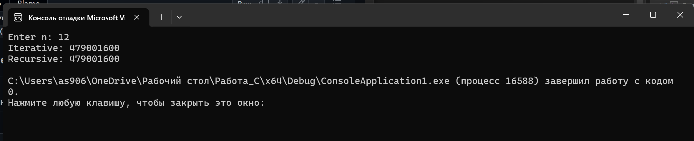
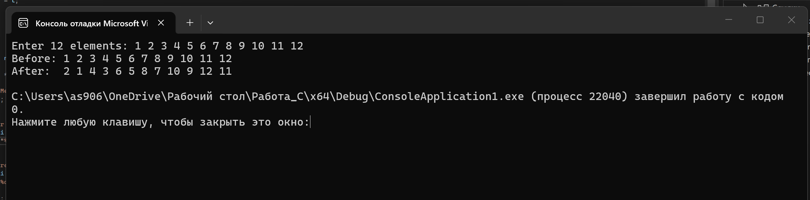
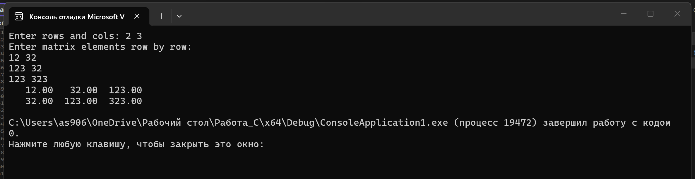
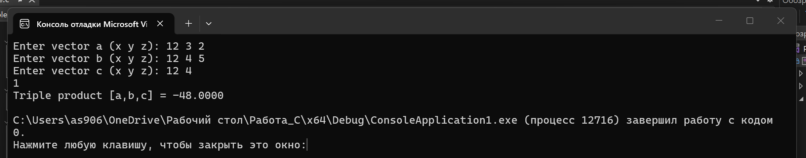
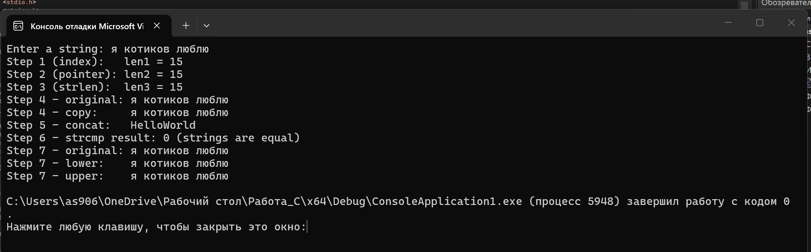
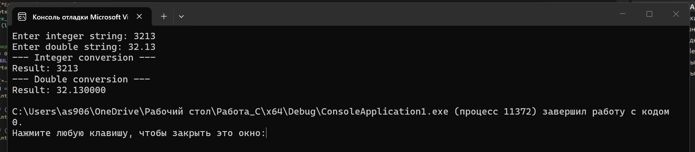
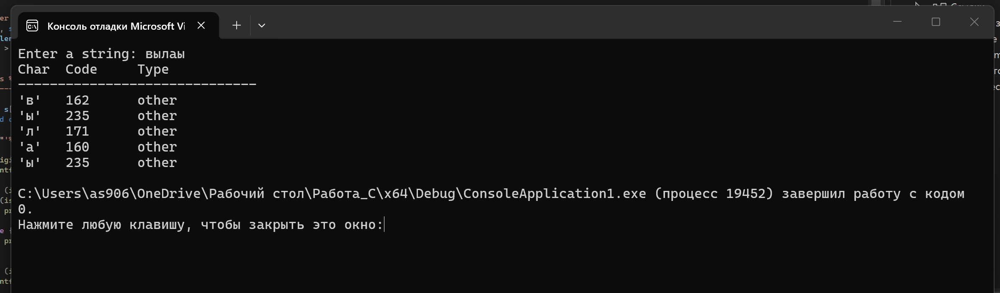

# Лабораторная работа № 4

## Тема
Введение в функции. Базовая работа со строками.

---

## Задача 1.1

### Постановка задачи
Задача 1.1: Факториал — цикл и рекурсия (task01.c)

Цель: реализовать и сравнить два способа вычисления факториала: итеративный и рекурсивный.  
Вход: целое число `n ≥ 0`.  
Выход: результат вычисления факториала двумя способами.  
Требование: реализовать две отдельные функции — через цикл и через рекурсию; оба результата для одного `n` должны совпадать; корректно обработан случай `n = 0`.

### Математическая модель
Факториал числа `n` определяется следующим образом:

`0! = 1`  
`n! = 1 × 2 × 3 × ... × n`, при `n ≥ 1`

Итеративная формула:

`result = 1; for i от 1 до n: result = result × i`

Рекурсивная формула:

`f(n) = 1`, если `n ≤ 1`  
`f(n) = n × f(n − 1)`, если `n > 1`

### Список идентификаторов

| Имя переменной | Тип данных | Смысловое обозначение |
|---|---|---|
| n | int | число, для которого вычисляется факториал |
| i | int | счётчик цикла |
| result | long long | промежуточный результат итеративного вычисления |

### Код программы

```c
#include <stdio.h>

long long factorial_iter(int n) {
    long long result = 1;
    int i;

    for (i = 2; i <= n; i++) {
        result *= i;
    }

    return result;
}

long long factorial_rec(int n) {
    if (n <= 1) {
        return 1;
    }

    return (long long)n * factorial_rec(n - 1);
}

int main(void) {
    int n;

    printf("Enter n: ");
    scanf("%d", &n);

    printf("Iterative: %lld\n", factorial_iter(n));
    printf("Recursive: %lld\n", factorial_rec(n));

    return 0;
}
```

### Результаты выполненной работы


---

## Задача 1.2

### Постановка задачи
Задача 1.2: Обмен чётных/нечётных ячеек массива (task02.c)

Цель: отработать передачу динамического массива в функцию и изменение данных по месту.  
Вход: динамический массив `int` из 12 элементов.  
Выход: массив после попарного обмена соседних элементов.  
Требование: функция выполняет попарный обмен соседних элементов: индексы 0↔1, 2↔3, ..., 10↔11; размер массива не меняется.

### Математическая модель
Для массива `a` длиной `n` выполняется следующая операция:

Для каждого чётного индекса `i` от 0 до `n−2` с шагом 2:

`swap(a[i], a[i+1])`

Пример: `[1, 2, 3, 4, 5, 6]` → `[2, 1, 4, 3, 6, 5]`

### Список идентификаторов

| Имя переменной | Тип данных | Смысловое обозначение |
|---|---|---|
| a | int* | указатель на динамический массив |
| n | size_t | размер массива |
| i | size_t | счётчик цикла |
| t | int | временная переменная для обмена |

### Код программы

```c
#include <stdio.h>
#include <stdlib.h>

void swap_pairs(int *a, size_t n) {
    size_t i;
    int t;

    for (i = 0; i + 1 < n; i += 2) {
        t = a[i];
        a[i] = a[i + 1];
        a[i + 1] = t;
    }
}

int main(void) {
    int *a;
    size_t i;
    const size_t n = 12;

    a = malloc(n * sizeof(*a));
    if (!a) {
        printf("Memory allocation error\n");
        return 1;
    }

    printf("Enter 12 elements: ");
    for (i = 0; i < n; i++) {
        scanf("%d", &a[i]);
    }

    printf("Before: ");
    for (i = 0; i < n; i++) {
        printf("%d ", a[i]);
    }
    printf("\n");

    swap_pairs(a, n);

    printf("After:  ");
    for (i = 0; i < n; i++) {
        printf("%d ", a[i]);
    }
    printf("\n");

    free(a);
    a = NULL;

    return 0;
}
```

### Результаты выполненной работы


---

## Задача 1.3

### Постановка задачи
Задача 1.3: Набор функций для матрицы double (task03.c)

Цель: выделять, заполнять, печатать и освобождать двумерный динамический массив без утечек памяти.  
Вход: размеры матрицы `rows`, `cols` и значения элементов.  
Выход: матрица в виде таблицы.  
Требование: реализовать отдельные функции выделения, освобождения, заполнения и печати; при ошибке выделения памяти освободить уже выделенные строки.

### Математическая модель
Матрица `M` размером `rows × cols` хранится как массив указателей на строки:

`M[i][j]` — элемент на строке `i` и столбце `j`

Выделение памяти:

1. Выделить массив из `rows` указателей.
2. Для каждого `i` выделить строку из `cols` элементов.

Освобождение выполняется в обратном порядке.

### Список идентификаторов

| Имя переменной | Тип данных | Смысловое обозначение |
|---|---|---|
| rows | size_t | количество строк матрицы |
| cols | size_t | количество столбцов матрицы |
| m | double** | указатель на матрицу |
| i | size_t | счётчик строк |
| j | size_t | счётчик столбцов |

### Код программы

```c
#include <stdio.h>
#include <stdlib.h>

double **alloc_matrix(size_t rows, size_t cols) {
    size_t i;
    double **m = malloc(rows * sizeof(*m));

    if (!m) {
        return NULL;
    }

    for (i = 0; i < rows; i++) {
        m[i] = malloc(cols * sizeof(*m[i]));

        if (!m[i]) {
            size_t k;

            for (k = 0; k < i; k++) {
                free(m[k]);
            }

            free(m);
            return NULL;
        }
    }

    return m;
}

void free_matrix(double **m, size_t rows) {
    size_t i;

    for (i = 0; i < rows; i++) {
        free(m[i]);
    }

    free(m);
}

void fill_matrix(double **m, size_t rows, size_t cols) {
    size_t i, j;

    printf("Enter matrix elements row by row:\n");

    for (i = 0; i < rows; i++) {
        for (j = 0; j < cols; j++) {
            scanf("%lf", &m[i][j]);
        }
    }
}

void print_matrix(double **m, size_t rows, size_t cols) {
    size_t i, j;

    for (i = 0; i < rows; i++) {
        for (j = 0; j < cols; j++) {
            printf("%8.2f", m[i][j]);
        }
        printf("\n");
    }
}

int main(void) {
    double **m;
    size_t rows, cols;

    printf("Enter rows and cols: ");
    scanf("%zu %zu", &rows, &cols);

    m = alloc_matrix(rows, cols);
    if (!m) {
        printf("Memory allocation error\n");
        return 1;
    }

    fill_matrix(m, rows, cols);
    print_matrix(m, rows, cols);

    free_matrix(m, rows);

    return 0;
}
```

### Результаты выполненной работы


---

## Задача 1.4

### Постановка задачи
Задача 1.4: Смешанное произведение трёх векторов в 3D (task04.c)

Цель: вычислять смешанное произведение через разбиение задачи на небольшие понятные функции.  
Вход: три вектора длины 3 в декартовых координатах `(x, y, z)`.  
Выход: смешанное произведение `[a, b, c]`.  
Требование: реализовать функции `cross3`, `dot3`, `triple3`; функция `triple3` использует две предыдущие функции, а не дублирует формулы вручную.

### Математическая модель
Векторное произведение:

`b × c = (by·cz − bz·cy, bz·cx − bx·cz, bx·cy − by·cx)`

Скалярное произведение:

`a · b = ax·bx + ay·by + az·bz`

Смешанное произведение:

`[a, b, c] = a · (b × c)`

Интерпретация: модуль смешанного произведения равен объёму параллелепипеда, построенного на трёх векторах. Если результат равен нулю, векторы компланарны.

### Список идентификаторов

| Имя переменной | Тип данных | Смысловое обозначение |
|---|---|---|
| a | double[3] | первый вектор |
| b | double[3] | второй вектор |
| c | double[3] | третий вектор |
| out | double[3] | результат векторного произведения |
| tmp | double[3] | промежуточный вектор b × c |

### Код программы

```c
#include <stdio.h>

void cross3(const double a[3], const double b[3], double out[3]) {
    out[0] = a[1] * b[2] - a[2] * b[1];
    out[1] = a[2] * b[0] - a[0] * b[2];
    out[2] = a[0] * b[1] - a[1] * b[0];
}

double dot3(const double a[3], const double b[3]) {
    return a[0] * b[0] + a[1] * b[1] + a[2] * b[2];
}

double triple3(const double a[3], const double b[3], const double c[3]) {
    double tmp[3];

    cross3(b, c, tmp);

    return dot3(a, tmp);
}

int main(void) {
    double a[3], b[3], c[3];

    printf("Enter vector a (x y z): ");
    scanf("%lf %lf %lf", &a[0], &a[1], &a[2]);

    printf("Enter vector b (x y z): ");
    scanf("%lf %lf %lf", &b[0], &b[1], &b[2]);

    printf("Enter vector c (x y z): ");
    scanf("%lf %lf %lf", &c[0], &c[1], &c[2]);

    printf("Triple product [a,b,c] = %.4f\n", triple3(a, b, c));

    return 0;
}
```

### Результаты выполненной работы


---

## Задача 2.1

### Постановка задачи
Задача 2.1: Базовые строковые операции (task05.c)

Цель: освоить базовые операции с C-строкой в пошаговом режиме.  
Вход: строка длиной около 10 латинских символов.  
Выход: результаты всех шагов: длина, копия, конкатенация, сравнение, регистр.  
Требование: выполнить 7 шагов согласно заданию; использовать `fgets` для ввода; передавать символы в `tolower`/`toupper` с приведением к `unsigned char`.

### Математическая модель
Длина строки — это количество символов до завершающего `NUL` (`'\0'`).

Три способа вычисления длины:
- Шаг 1: цикл с индексом `i` до `s[i] != '\0'`
- Шаг 2: цикл через указатель `p` до `*p != '\0'`
- Шаг 3: библиотечная функция `strlen`

Инвариант: `len1 == len2 == len3`

### Список идентификаторов

| Имя переменной | Тип данных | Смысловое обозначение |
|---|---|---|
| my_string | char[32] | входная строка |
| copy | char[32] | копия строки |
| dst | char[64] | буфер для конкатенации |
| len1 | int | длина через индекс |
| len2 | int | длина через указатель |
| len3 | size_t | длина через strlen |
| p | char* | указатель для обхода строки |
| i | int | счётчик / индекс символа |

### Код программы

```c
#define _CRT_SECURE_NO_WARNINGS
#include <stdio.h>
#include <string.h>
#include <ctype.h>

#define MY_SIZE 32

int main(void) {
    char my_string[MY_SIZE];
    char copy[MY_SIZE];
    char dst[64];
    const char *src2 = "World";
    char *p;
    int len1, len2, i;
    size_t len3;

    printf("Enter a string: ");
    if (fgets(my_string, sizeof(my_string), stdin)) {
        size_t slen = strlen(my_string);
        if (slen > 0 && my_string[slen - 1] == '\n') {
            my_string[slen - 1] = '\0';
        }
    }

    /* Шаг 1: длина через индекс */
    len1 = 0;
    for (i = 0; my_string[i] != '\0'; i++) {
        len1++;
    }
    printf("Step 1 (index):   len1 = %d\n", len1);

    /* Шаг 2: длина через указатель */
    len2 = 0;
    p = my_string;
    while (*p != '\0') {
        len2++;
        p++;
    }
    printf("Step 2 (pointer): len2 = %d\n", len2);

    /* Шаг 3: strlen */
    len3 = strlen(my_string);
    printf("Step 3 (strlen):  len3 = %zu\n", len3);

    /* Шаг 4: копирование */
    strcpy(copy, my_string);
    printf("Step 4 - original: %s\n", my_string);
    printf("Step 4 - copy:     %s\n", copy);

    /* Шаг 5: конкатенация */
    dst[0] = '\0';
    if (strlen("Hello") + strlen(src2) + 1 < sizeof(dst)) {
        strcpy(dst, "Hello");
        strcat(dst, src2);
    }
    printf("Step 5 - concat:   %s\n", dst);

    /* Шаг 6: сравнение */
    {
        int cmp = strcmp(my_string, copy);
        printf("Step 6 - strcmp result: %d", cmp);
        if (cmp < 0) {
            printf(" (first is less)\n");
        } else if (cmp == 0) {
            printf(" (strings are equal)\n");
        } else {
            printf(" (first is greater)\n");
        }
    }

    /* Шаг 7: регистр */
    {
        char lower[MY_SIZE], upper[MY_SIZE];

        for (i = 0; my_string[i] != '\0'; i++) {
            lower[i] = (char)tolower((unsigned char)my_string[i]);
            upper[i] = (char)toupper((unsigned char)my_string[i]);
        }
        lower[i] = '\0';
        upper[i] = '\0';

        printf("Step 7 - original: %s\n", my_string);
        printf("Step 7 - lower:    %s\n", lower);
        printf("Step 7 - upper:    %s\n", upper);
    }

    return 0;
}
```

### Результаты выполненной работы


---

## Задача 2.2

### Постановка задачи
Задача 2.2: Конвертация строк в числа (task06.c)

Цель: безопасно преобразовывать текст в `int` и `double`, чтобы программа корректно реагировала на ошибочный ввод.  
Вход: две строки — одна с целым числом, другая с числом с плавающей точкой.  
Выход: результат преобразования и сообщение об успешности или причине ошибки.  
Требование: использовать `strtol` для целого и `strtod` для вещественного; перед преобразованием обнулять `errno`; проверять `endptr`, `errno == ERANGE`, наличие лишних символов.

### Математическая модель
Преобразование строки в целое число через `strtol`:

`v = strtol(text, &end, 10)`

Корректность проверяется по трём условиям:
1. `end != text` — была распознана хотя бы одна цифра
2. `errno != ERANGE` — нет переполнения
3. `*end == '\0'` или `*end == '\n'` — нет лишних символов

Аналогично для `strtod`.

### Список идентификаторов

| Имя переменной | Тип данных | Смысловое обозначение |
|---|---|---|
| buf_int | char[64] | строка с целым числом |
| buf_dbl | char[64] | строка с вещественным числом |
| end | char* | указатель на первый нераспознанный символ |
| v | long | результат strtol |
| d | double | результат strtod |

### Код программы

```c
#include <stdio.h>
#include <stdlib.h>
#include <errno.h>
#include <string.h>

int main(void) {
    char buf_int[64], buf_dbl[64];
    char *end;
    long v;
    double d;

    printf("Enter integer string: ");
    if (fgets(buf_int, sizeof(buf_int), stdin)) {
        size_t len = strlen(buf_int);
        if (len > 0 && buf_int[len - 1] == '\n') buf_int[len - 1] = '\0';
    }

    printf("Enter double string: ");
    if (fgets(buf_dbl, sizeof(buf_dbl), stdin)) {
        size_t len = strlen(buf_dbl);
        if (len > 0 && buf_dbl[len - 1] == '\n') buf_dbl[len - 1] = '\0';
    }

    /* Конвертация целого */
    errno = 0;
    end = NULL;
    v = strtol(buf_int, &end, 10);

    printf("--- Integer conversion ---\n");
    if (end == buf_int) {
        printf("Error: no digits found\n");
    } else if (errno == ERANGE) {
        printf("Error: value out of range\n");
    } else if (*end != '\0') {
        printf("Error: extra characters after number: '%s'\n", end);
    } else {
        printf("Result: %ld\n", v);
    }

    /* Конвертация вещественного */
    errno = 0;
    end = NULL;
    d = strtod(buf_dbl, &end);

    printf("--- Double conversion ---\n");
    if (end == buf_dbl) {
        printf("Error: no digits found\n");
    } else if (errno == ERANGE) {
        printf("Error: value out of range\n");
    } else if (*end != '\0') {
        printf("Error: extra characters after number: '%s'\n", end);
    } else {
        printf("Result: %f\n", d);
    }

    return 0;
}
```

### Результаты выполненной работы


---

## Задача 2.3

### Постановка задачи
Задача 2.3: Классификация символов (task07.c)

Цель: научиться классифицировать каждый символ строки с помощью функций из `ctype.h`.  
Вход: строка длиной 10–20 символов (цифры, латиница, пробелы, знаки пунктуации).  
Выход: список, где для каждого символа указано, чем он является.  
Требование: организовать цикл по всем символам до `NUL`; приводить символ к `unsigned char` перед передачей в функции `is*`.

### Математическая модель
Для каждого символа `c` строки выполняется набор проверок:

- `isdigit(c)` — цифра (`0`–`9`)
- `isalpha(c)` — буква (`a`–`z`, `A`–`Z`)
- `isspace(c)` — пробельный символ (пробел, `\t`, `\n` и др.)
- `ispunct(c)` — знак пунктуации

Функции принимают `unsigned char`, поэтому необходимо приведение.

### Список идентификаторов

| Имя переменной | Тип данных | Смысловое обозначение |
|---|---|---|
| s | char[64] | входная строка |
| i | int | индекс текущего символа |
| c | unsigned char | текущий символ с приведением типа |

### Код программы

```c
#include <stdio.h>
#include <string.h>
#include <ctype.h>

int main(void) {
    char s[64];
    int i;

    printf("Enter a string: ");
    if (fgets(s, sizeof(s), stdin)) {
        size_t len = strlen(s);
        if (len > 0 && s[len - 1] == '\n') s[len - 1] = '\0';
    }

    printf("%-5s %-8s %s\n", "Char", "Code", "Type");
    printf("------------------------------\n");

    for (i = 0; s[i] != '\0'; i++) {
        unsigned char c = (unsigned char)s[i];

        printf("'%c'   %-8d ", c, (int)c);

        if (isdigit(c)) {
            printf("digit\n");
        } else if (isalpha(c)) {
            if (isupper(c)) {
                printf("uppercase letter\n");
            } else {
                printf("lowercase letter\n");
            }
        } else if (isspace(c)) {
            printf("space\n");
        } else if (ispunct(c)) {
            printf("punctuation\n");
        } else {
            printf("other\n");
        }
    }

    return 0;
}
```

### Результаты выполненной работы

