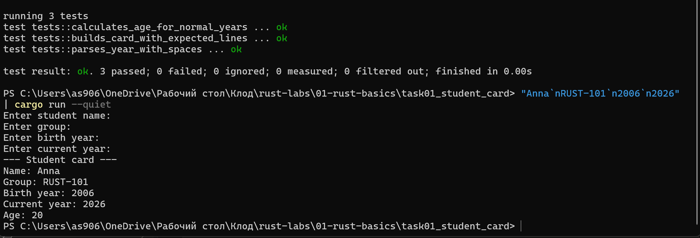

# Лабораторная работа №1
## Rust: первые программы, функции, структуры и перечисления

---

## Задача 1.1. Карточка студента

**Проект:** `task01_student_card`

Программа запрашивает у пользователя имя, группу, год рождения и текущий год, после чего выводит карточку студента. Осваиваются переменные, строки `String`, чтение из стандартного ввода, преобразование текста в число и выделение логики в функции.

---

## Задача 1.2. Мини-каталог книг

**Проект:** `task02_library_catalog`

Программа создаёт каталог книг и выводит отчёт: список книг, общее количество, количество научных книг, сумму страниц и самую новую книгу. Используются `struct`, `enum`, блоки `impl`, вектор `Vec` и функции, принимающие срез `&[Book]`.

