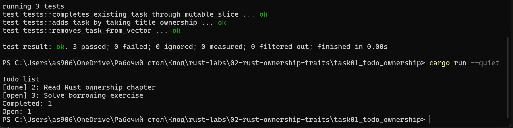
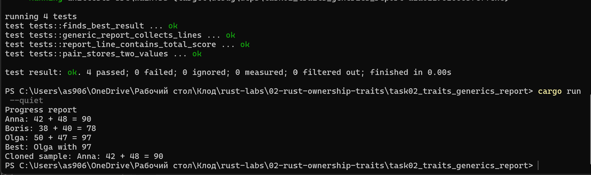

# Лабораторная работа №2
## Rust: владение, ссылки, traits и generics
---

## Задача 2.1. Список дел и владение данными

**Проект:** `task01_todo_ownership`

Программа создаёт список дел, добавляет задачи, отмечает одну выполненной и удаляет одну. Показывает, как `String` передаётся во владение, `&mut Vec<Task>` изменяет коллекцию, а `&[Task]` позволяет читать без изменений.

---

## Задача 2.2. Traits, generics и учебный отчёт

**Проект:** `task02_traits_generics_report`

Программа строит отчёт о результатах студентов. Используется обобщённая структура `Pair<T>`, trait `ReportLine` и generic-функция `build_report<T: ReportLine>`. Показывает явное копирование через `Clone`.

